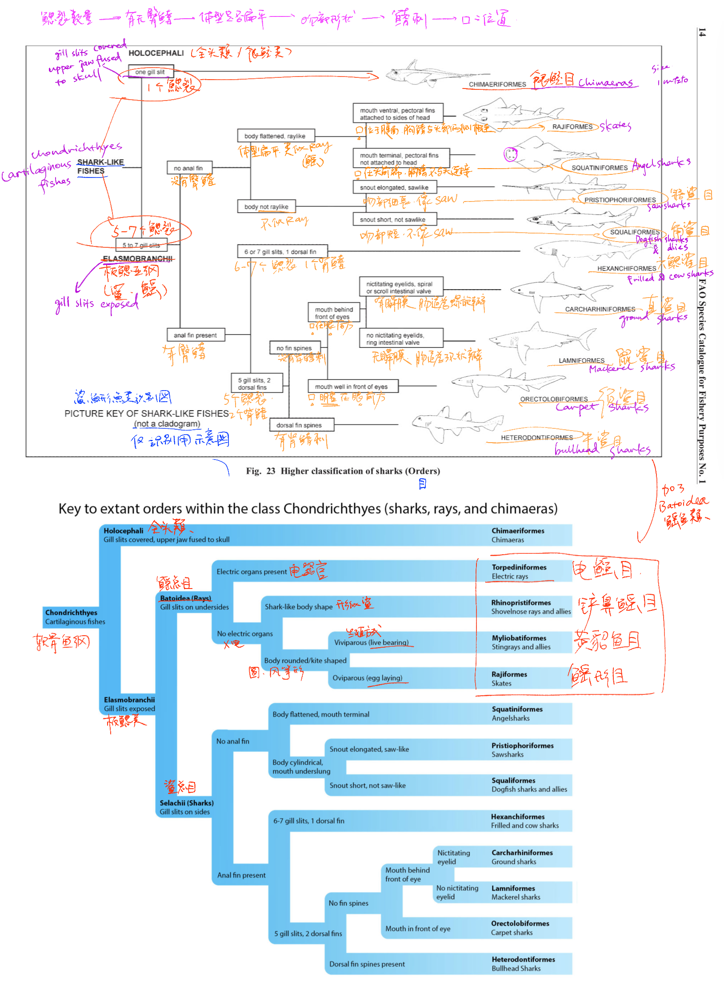

## 软骨鱼纲目级为止的梳理

```
软骨鱼纲目级为止的梳理。  
同时推荐FAO资料库。  
```


---
### 大分类可以记一下拉丁名

-  chondrichthyes 软骨鱼纲
  - holocephali 全头类
  - selachii 鲨类 / 鲨总群
  - batoidea 鳐类 / 鳐总群 

---
### 接下来进入到目级，可以用下面这个识别用的示意图。



- 下面补充的蓝色的示意图多了batoidea鳐类，其他差不多。蓝色的图出自哪里我忘了，在手机里存了比较久，搜到出处我补上。手写字迹是我写的。

- 上面的这张图出自[FAO (Food and Agriculture Organization of the United Nations)联合国粮食及农业组织](https://www.fao.org/home/en) 2001年出版的《Sharks of the World》（[网站](https://openknowledge.fao.org/items/5cf9ff28-6a21-4aa1-99e0-f6c15a8b8881) / [pdf全文](https://www.iucnssg.org/uploads/5/4/1/2/54120303/fao_species_catalogue_for_fishery_purposes_-_2001_-_sharks_of_the_world_-_an_annotated_and_illustrated_catalogue_of_shark_species_known_to_date_-_volume_2_-_bullhead_mackerel_and_carpet_sharks.pdf)）。

- 本篇除了理清软骨鱼纲到目级为止的情况，还有一个目的就是记录一下FAO的资料库。该组织的出版物集中在[这里](https://openknowledge.fao.org/collections/e970a448-d1c8-4cce-8368-bbdeec41e9d7)，可以尝试检索自己需要的内容。

- 有关软骨鱼纲的资料会在接下来的笔记当中逐步梳理。梳理首先会以各大组织为主要轴，这类研究如果要做到质量可靠内容前沿，通常需要庞大的资金和人力物力，因此我会从组织开始再细化到个人研究者和民间爱好者。

* *联合国一共都有哪些组织，可以参考[这条链接](https://www.un.org/en/about-us/un-system)。*

