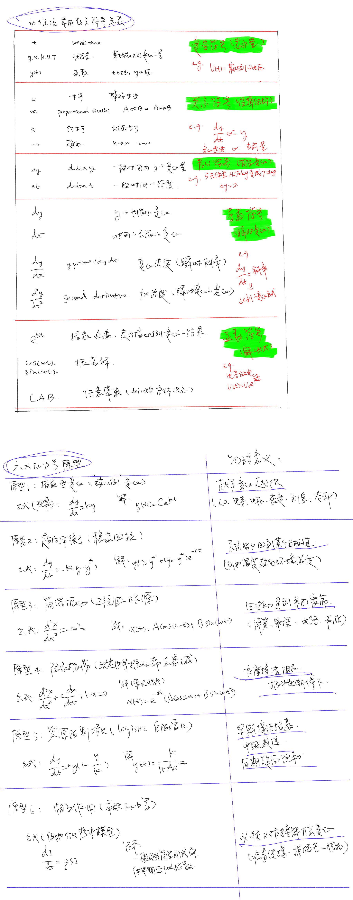

## 动力系统常用数学符号和六种动力学原型（公式+解）

```
自然界万事万物都可以速查这几类根结构。
```

  

---

直观的例子：

### 指数原型

`dy/dt = k y`

> 越多越快，越少越慢；变化完全取决于当前量。

eg

- 钱的利息（复利）
- 信用卡欠款增长
- 人口增长（不考虑资源）
- 放射性衰变（越多衰得越快）
- 电容放电初期（RC 电路）
- 咖啡浓度稀释（连续稀释）
- 小区里某个流言越来越多人知道
- 手机电量掉得快（满电时掉电更快）
- 病毒传播的早期阶段
- 水果烂掉后变烂速度越来越快（微生物指数繁殖）

⸻

### 稳态回拉（趋向某个固定值）

`dy/dt = -k (y - y*)`

> 系统被拉回到某个固定值，不会无限增长或减少。

eg

- 咖啡放着会变成室温
- 热水逐渐变成室温
- 冰块逐渐升温到 0°C
- 空调开着会把温度拉到设定温度
- 你用力搅拌杯子，水面 eventually 会变平静
- 人的体温恢复到 37°C
- 经济价格回到“均衡价格”
- 一堆衣服被烘干后逐渐接近空气湿度
- 高楼在风中轻微摇摆后逐渐稳定
- WiFi AGC（自动增益控制）把信号调回稳定大小

⸻

### 无阻尼振荡（完全来回、永不衰减）

`d²x/dt² = -ω² x`

像弹簧：来回震荡、永不消失（理想化）。

eg

- 理想弹簧来回振动（现实中会有阻尼）
- 完全无摩擦的冰面摆动
- 理想单摆（小振幅）
- 理想 LC 电子振荡（无线电载波本质）
- 声波在理论模型中的传播
- 完美的钟摆（假设没有空气阻力）
- 完美的弦振动（理论中的吉他弦）

现实世界几乎没有纯无阻尼的，但它是基本原型。

⸻

### 阻尼振荡（现实世界所有振动）

`d²x/dt² + c dx/dt + kx = 0`

> 来回振荡，但越来越小，最终停下来。

eg

- 风扇关闭后慢慢停下
- 秋千被推后越荡越小
- 车的悬挂系统回弹
- 压一下床垫会轻微弹几下就停
- 冰箱会“嗡嗡”一声再停
- 地震后建筑晃动几下就稳住
- 有阻尼的 LC 电路
- 麦克风敲一下发出的“嘣”声
- 播放器低频扬声器的 cone 回落
- 船在水里摇晃后逐渐停

现实世界几乎所有振动都属于这一类。

⸻

### Logistic（自限性增长 / S 型曲线）

`dy/dt = r y(1 - y/K)`

> 初期快，中期变慢，后期趋于饱和（资源有限）。

eg

- 一个微信群人数的增长（刚开始快速，后面慢）
- 城市人口增长（受资源限制）
- 技术普及度（例如智能手机普及率）
- 新的社交媒体用户增长
- 一湖水里的鱼类数量增长
- 植物在有限土壤中的生长
- 学生学习新技能的速度（初期快，后面瓶颈）
- 新产品销量（从爆发到饱和）
- 微博热搜热度曲线
- 肉在腌制过程中盐分渗透速度

⸻

### 相互作用原型（变化取决于两者相遇）

`dy/dt = β S I`

> 双方接触才能发生变化；不是单变量能控制的。

eg

- 传染病传播（需要感染者接触健康者）
- 理发店排队时间 = 店员 × 顾客数量
- 市场交易量 = 买家 × 卖家（两者相遇）
- 两人合作可以完成任务（单人不能）
- 打架双方互相伤害（攻击 × 暴露）
- 捕食者–猎物关系（狼吃羊）
- 需要两个物种才能繁殖的情况
- 两个化学物质发生反应
- 社交场合中人气扩散（你必须与人互动）
- 两辆车在十字路口接触导致事故（概率 ∝ 流量 × 流量）


